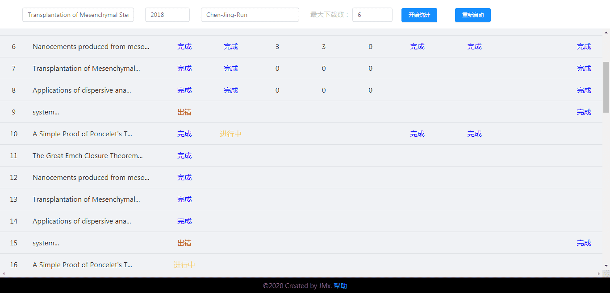
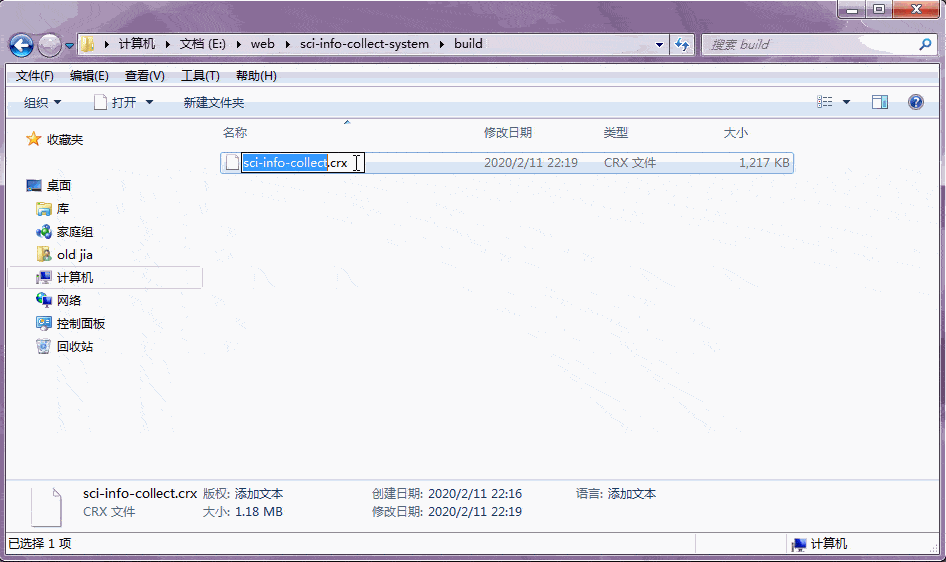
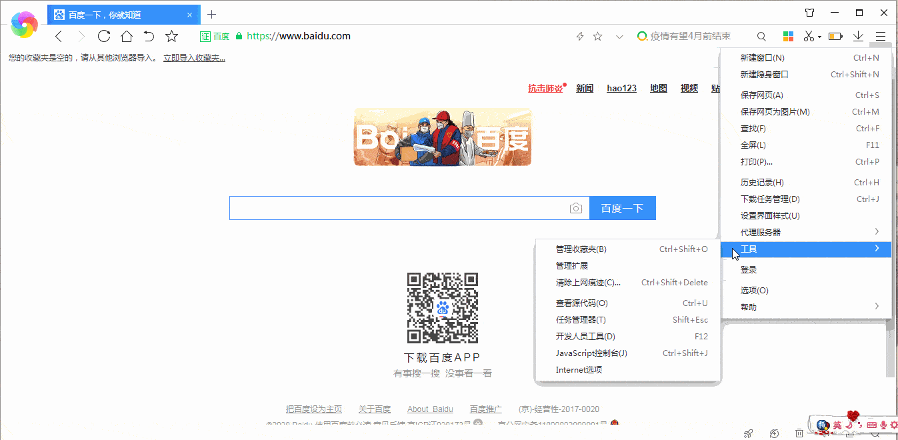
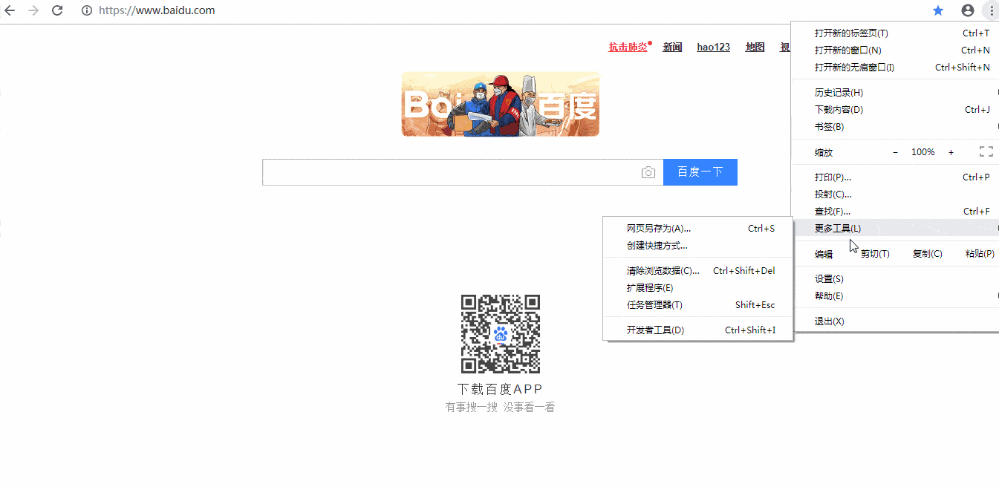
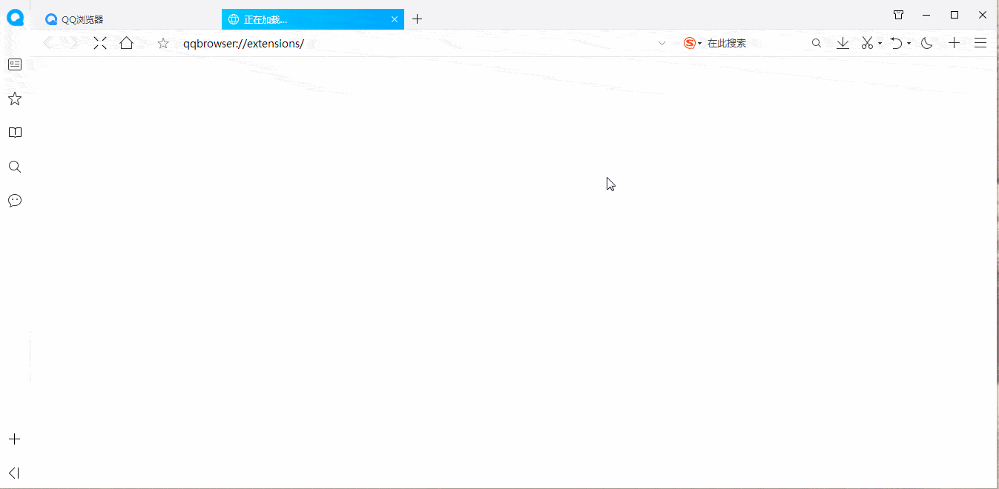
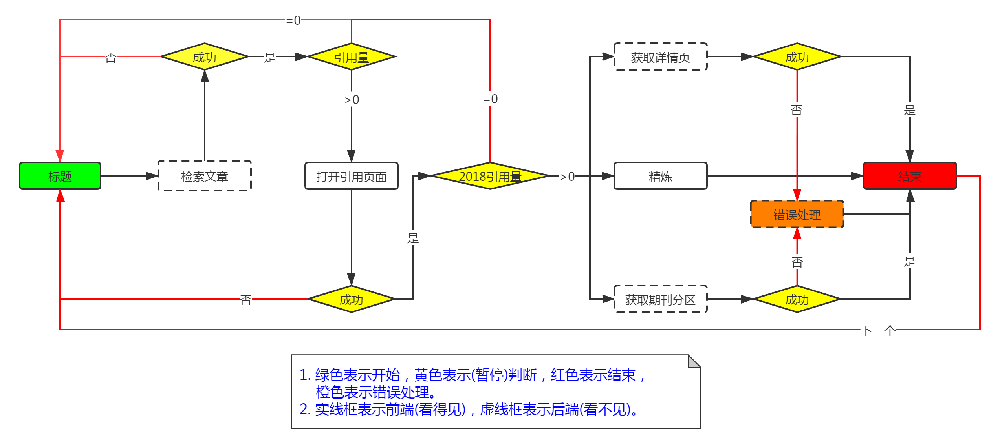

<!-- MarkdownTOC -->

- [科研成果统计系统](#%E7%A7%91%E7%A0%94%E6%88%90%E6%9E%9C%E7%BB%9F%E8%AE%A1%E7%B3%BB%E7%BB%9F)
	- [操作界面](#%E6%93%8D%E4%BD%9C%E7%95%8C%E9%9D%A2)
		- [初始状态](#%E5%88%9D%E5%A7%8B%E7%8A%B6%E6%80%81)
		- [工作状态](#%E5%B7%A5%E4%BD%9C%E7%8A%B6%E6%80%81)
	- [使用教程](#%E4%BD%BF%E7%94%A8%E6%95%99%E7%A8%8B)
		- [安装插件](#%E5%AE%89%E8%A3%85%E6%8F%92%E4%BB%B6)
		- [开始使用](#%E5%BC%80%E5%A7%8B%E4%BD%BF%E7%94%A8)
		- [整体演示](#%E6%95%B4%E4%BD%93%E6%BC%94%E7%A4%BA)
	- [设计流程图](#%E8%AE%BE%E8%AE%A1%E6%B5%81%E7%A8%8B%E5%9B%BE)
	- [第三方库](#%E7%AC%AC%E4%B8%89%E6%96%B9%E5%BA%93)
	- [Q&A](#qa)
	- [Todos](#todos)

<!-- /MarkdownTOC -->
[TOC]

## 科研成果统计系统

这是一款运行在使用Chromium内核的浏览器上(如：360极速浏览器，Google Chrome浏览器，Opera浏览器，QQ浏览器。但不支持IE，Firefox等非Chromium内核的浏览器)的插件，主要用于统计科研成果。

### 操作界面

#### 初始状态

#### 工作状态

### 使用教程

#### 安装插件

首先将插件解压缩

然后将解压后的插件安装到浏览器。不同浏览器的安装方法如下

**360极速浏览器(测试版本：12.0)**：

**Opera浏览器(测试版本：64.0.3417.61)：**

**Chrome浏览器(测试版本：74.0.3729.131)：**

**QQ浏览器(版本：10.5.2)：**

#### 开始使用

##### 输入 

1. 文章标题列表：title1 && title2 && title3 && ...

   两个标题间以‘&&’隔开。

2. 年份：2018, 2019，...

   用以筛选特定时间内引用这篇文献的论文，不同年份以逗号隔开。

3. 作者姓名：Chen-Jing-Run

   输入姓名拼音，首字母均大写且以短横杠隔开。
   
4. 最大下载数：1-10之间，默认为3.

    可以同时搜索多个文章。但由于每一次搜索都会打开一个浏览器标签页，因此，最大下载数越大，同时打开的标签页也就越多，所需计算机资源也就越多，因此要视计算机性能而定，并不是越多越好。

##### 输出 

1. 检索页：成功/出错。如果出错，可能情况是检索不到/检索到多个结果。
2. 引用页：成功/出错。指定年份的引用页。
3. 引用量：整数。指定年份的总引用量。
4. 他引量：整数。指定年份的他引量。
5. 自引量：整数。指定年份的自引量。
6. 详情页：成功/出错。
7. 期刊分区页：成功/出错。
8. 作者顺序：整数。指定姓名在检索结果作者列表中的位置。
9. 进度：空/完成。

#### 整体演示

### 设计流程图 

### 第三方库

1. React：create-react-app.
3. Antd.
3. Booststrap.
4. Chrome插件运行环境.
5. 上述库的若干依赖.

### Q&A

1. 软件运行较慢？

   由于数据是从[Web of Science](http://apps.webofknowledge.com/)获取，而其服务器在国外，因此访问速度较慢。此外，软件还受网速的影响。

2. 软件是否可以一直使用？

   不可以。由于数据是从[Web of Science](http://apps.webofknowledge.com/)获取，如果该网站更新系统，则软件可能无法正常使用。后续会提供更新。
   
3. **bug提交**

    请发送遇到的问题(建议附上表格截图)至​**e-mail**：jiaminxin@outlook.com。
4. 本文档图片无法显示？
	可以访问这里[README](https://www.yuque.com/docs/share/cae8a3ca-7192-4a63-8bf7-5852a5bdf884).

### Todos

1. 登录中科院分区系统，根据杂志名过去分区信息。

    由于中科院分区表网站登录时设置了人机验证，因此目前无法后台获取查询权限，需要用户登录来获取查询权限。
